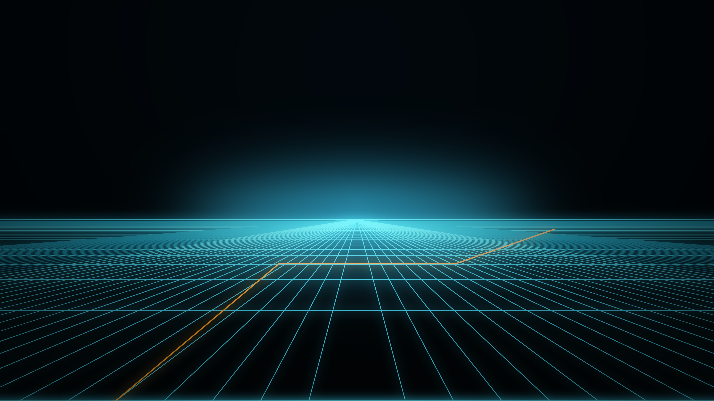

# Tron

An Omarchy theme for the Grid: near-black backdrops, cyan circuitry, and a
single orange line for the programs that went rogue.



## Install

```bash
omarchy theme install https://github.com/<you>/omarchy-tron.git
omarchy theme set tron
```

`omarchy theme install` strips the `omarchy-` prefix, so the repo installs
under the theme name **tron**.

## Develop against it locally

Point Omarchy at your working copy instead of a clone, so edits apply on the
next `omarchy theme set`:

```bash
ln -sfn ~/Work/omarchy-tron ~/.config/omarchy/themes/tron
omarchy theme set tron
```

A symlinked theme counts as hand-written rather than cloned, which means
Omarchy will stage every file in it — including any `hyprland.lua` or terminal
config you add. Themes installed from a git repo are restricted to colour.

## What's in here

| File | Purpose |
|------|---------|
| `colors.toml` | The whole palette. Omarchy renders Alacritty, Ghostty, Kitty, foot, btop, Neovim, Chromium, the shell, and the lock screen from it. |
| `hyprland.lua` | Window glow: thick gradient borders, the accent-cyan halo on the focused window, dimming for everything else. Replaces the file Omarchy would generate. |
| `shell.controls.toml` | Replaces just the `[controls]` section of the generated `shell.toml`, so hover/focus/selected chrome in the bar and menus lights up. |
| `icons.theme` | GTK icon theme to pair with it. |
| `backgrounds/` | Wallpapers, cycled with `omarchy theme bg next`. |
| `tools/` | Regenerates `backgrounds/` from vector primitives. |
| `gtk.css` | GTK4 hover glow for Nautilus and other GTK apps. Installed by the hook below, not by Omarchy. |
| `hooks/` | `theme-set` hook that puts `gtk.css` where GTK4 reads it. |
| `shell-plugin/` | A cloned Omarchy bar (`tron.bar`) that glows the hovered module. Not part of the theme — installed separately, see below. |

## Palette

| Role | Colour | |
|------|--------|--|
| accent / cyan | `#5ee7ff` | the Grid |
| orange | `#ff9f1c` | Clu |
| background | `#050b0f` | |
| foreground | `#d6f4fc` | |
| red | `#ff4d6d` | |
| yellow | `#ffc93c` | |
| green | `#3ff0a0` | |
| blue | `#3aa9ff` | |
| magenta | `#b06dff` | |

Active window borders run a 45° cyan-to-orange gradient at full alpha; inactive
ones fall back to a dim `#11384a`.

## Glow

Hyprland has no glow primitive, so `hyprland.lua` builds one out of the drop
shadow: `range = 44` with `render_power = 2` (a slower falloff than the default
3) spreads accent cyan off the window edge instead of hugging it, and
`color_inactive` is fully transparent so only the focused window carries it.
Unfocused windows are dimmed 20% on top of that.

**This needs gaps and borders to be visible.** Omarchy's `window-no-gaps`
toggle sets `gaps_out`, `gaps_in`, and `border_size` to 0, and it loads after
the theme, so it wins — the halo has nowhere to render and the gradient border
has no width. Turn it off with `SUPER + SHIFT + BACKSPACE`, or:

```bash
omarchy-hyprland-toggle window-no-gaps off
```

In the shell, hover is cyan at 75% border alpha and keyboard/tab focus goes one
louder — 2px, fully opaque `#8df2ff`. Popups, notifications, and the lock input
already track the Hyprland active-border gradient, so they pick up the
cyan-to-orange edge for free.

## Bar hover glow

`shell.toml` has no token for it: Omarchy's `WidgetButton` shows a tooltip on
hover and nothing else, so a bar icon that lights up needs QML, not colour.
`shell-plugin/` is a clone of the built-in bar with that one behaviour added.

```bash
ln -sfn ~/Work/omarchy-tron/shell-plugin ~/.config/omarchy/plugins/tron.bar
omarchy plugin enable tron.bar
omarchy restart shell
```

Back to the stock bar with `omarchy plugin enable omarchy.bar`.

Inside, `ModuleSlot` gains a `ShaderEffectSource` copy of the module and two
`MultiEffect` passes over it — a tight core that keeps the glyph shape and a
wide halo bleeding into the bar — both tinted `Color.accent` and faded in over
160ms on `slot.hovered`. It samples through a `ShaderEffectSource` rather than
the item's own layer because a `MultiEffect` consumes the layer it reads:
sourcing the item directly renders the blur *instead of* the module, and the
bar loses its sharp glyphs. The texture goes `live` only while lit, so an idle
bar is not re-rendering one per module.

Two things to know about cloning a bar:

- **Upstream `Bar.qml` cannot be cloned as-is.** `shell.qml` builds the
  built-in bar from an inline `Component` that sets `omarchyPath`,
  `barWidgetRegistry`, and `barConfig` at construction, but loads a *plugin*
  bar with `Loader { source: <url> }` and injects them from `onLoaded` — after
  construction. The three `required property` declarations are therefore never
  initialized, the Loader errors, and the fallback silently reverts to the
  built-in bar without saying why (`errorString` is not defined in that scope,
  so the handler throws before it can log). This clone drops `required` and
  gives them defaults.
- **Edits need `omarchy restart shell`.** Plugin hot-reload does not notice
  writes through the symlink.

Cloning pins ~1800 lines of `Bar.qml` at the version it was copied from; it
will not pick up upstream bar fixes until re-cloned.

## File manager hover glow

GTK4 has a real `filter` property (4.2+), so a zero-offset `drop-shadow` is a
glow — no compositing tricks needed. Two stacked, a tight one that holds the
icon's shape and a wide one that bleeds, on `gridview > child:hover` (Nautilus'
icon view) plus `columnview row:hover` and `listview > row:hover` (its list
view and sidebar).

GTK4 reads exactly one user stylesheet, `~/.config/gtk-4.0/gtk.css`, and
Omarchy has no template for it — `omarchy-theme-set-gnome` only flips
Adwaita-dark and the icon theme. So the theme ships `gtk.css` and a `theme-set`
hook copies it into place on every theme change:

```bash
omarchy hook install theme-set hooks/theme-set-gtk-glow
omarchy theme set tron
```

The hook writes a marker as the first line and refuses to touch a `gtk.css`
that does not carry it, so a hand-written one survives. Switching to a theme
that ships no `gtk.css` removes the file again.

Two caveats:

- **GTK reads `gtk.css` once, at app startup.** Editing it, or changing themes,
  does nothing to a running Nautilus — quit and reopen it.
- `omarchy hook install` *copies* the script. Re-run it after editing
  `hooks/theme-set-gtk-glow`.

## Backgrounds

Every wallpaper is generated, not photographed — rerun the generator after
changing a colour in `tools/gen_mvg.py`:

```bash
./tools/generate-backgrounds.sh    # needs ImageMagick 7 + python3
```

1. **grid** — the light-cycle plane receding to a glowing horizon
2. **circuits** — board traces with a few hot orange runs
3. **identity-disc** — concentric rings on black

## License

MIT
